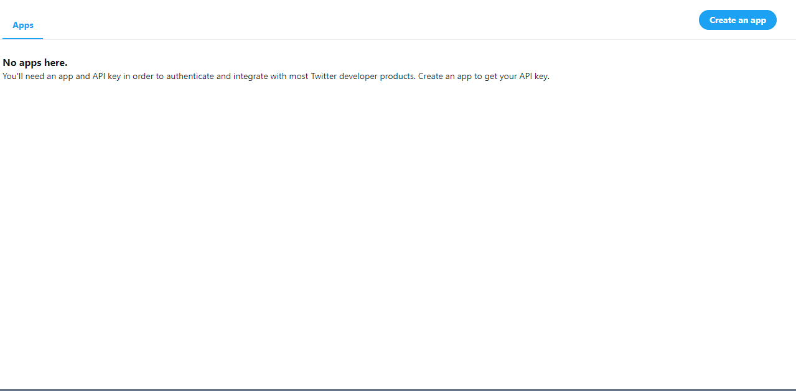
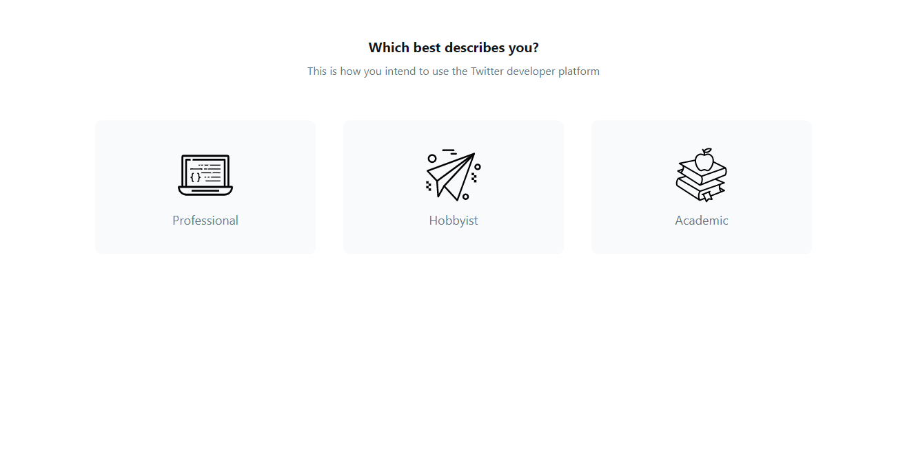
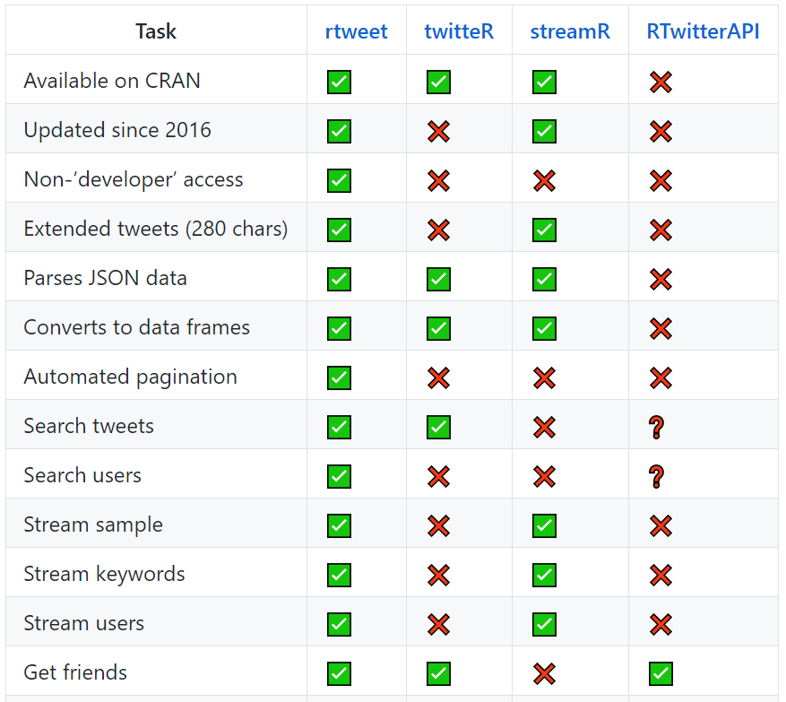

## 1줄 요약
- R을 활용하여 트위터 데이터를 수집하는 방법 및 절차에 대해 배우도록 한다. 

## 트위터 API 인증
- https://apps.twitter.com에 접속한다. 
  + 회원가입을 진행한다. 

- `create an app` 버튼을 클릭한다. 


- 필자는 `Hobbysit`-`Exploring the API`를 선택했다. 

  + 그 후에 개인 정보 등을 입력해야 한다. 
  + 휴대폰, 이메일 인증 등

- 인증 메일이 오기전까지는 조금 시일이 걸린다. 


## rtweet 패키지
- 별도의 인증 절차 없이 사용 가능한 패키지
  + https://github.com/ropensci/rtweet
  
- 우선 설치 후, 사용해보도록 한다.
  + 본 코드는 Github 예제로 있는 코드를 가져온 것임

```r
# install.packages("rtweet")
library(rtweet)
library(dplyr)
library(ggplot2)
```

### Search Tweets
- `search_tweets()` 함수를 활용하면 매우 쉽게 데이터를 가져올 수 있다. 

```r
rstats <- search_tweets("#테슬라", n = 1000, include_rts = FALSE) %>% 
  select(name, location, description)
```
- 앱 인증 절차만 진행이 되면 데이터를 가져올 수 있다.


```r
glimpse(rstats)
```

```
## Rows: 132
## Columns: 3
## $ name        <chr> "얼리어답터", "얼리어답터", "허프포스트코리아", "뉴스핌", "뉴스핌", "disclosure", ~
## $ location    <chr> "", "", "SEOUL", "Korea", "Korea", "", "", "", "", "", "",~
## $ description <chr> "2001년부터 전세계의 테크 트랜드를 한국에 소개했던 얼리어답터가 완전히 새롭게 다시 시작합니다. 더 ~
```

- 텍스트 데이터를 수집할 수 있었다. 

### 그 외 패키지와의 비교
- Github에는 `rtweet` 패키지가 어떤 Task를 수행하는 비교하는 표가 있다. 



